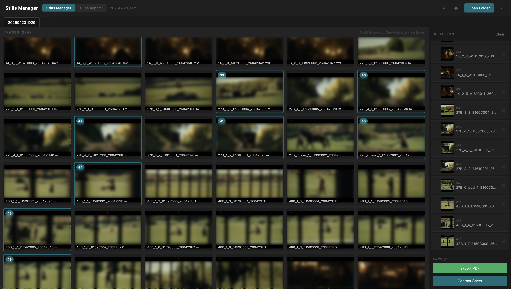
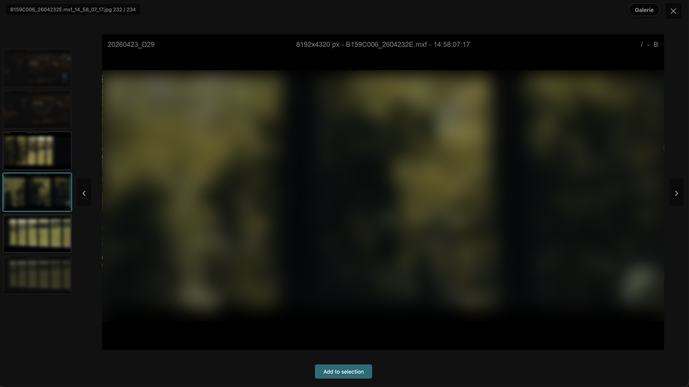
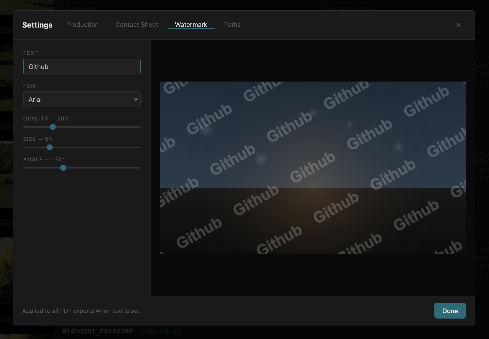
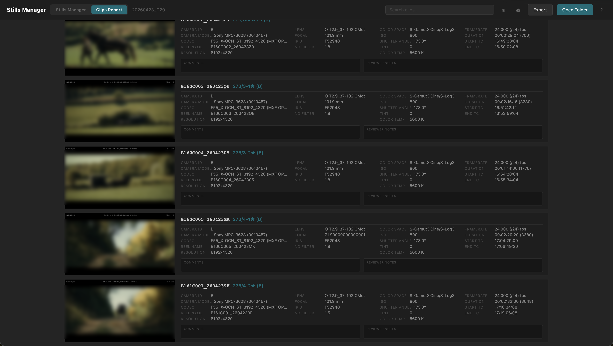
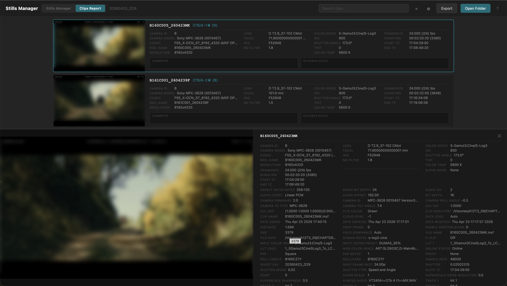
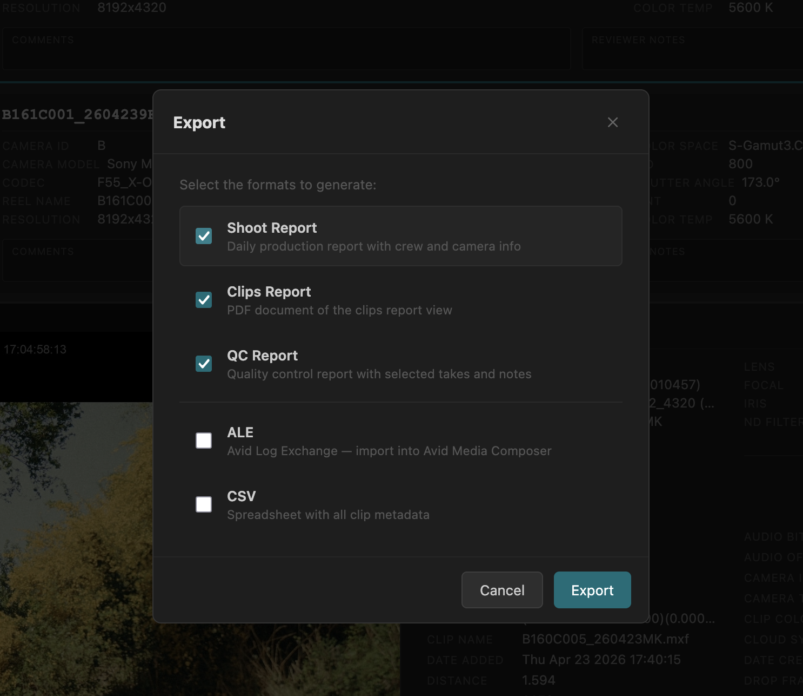
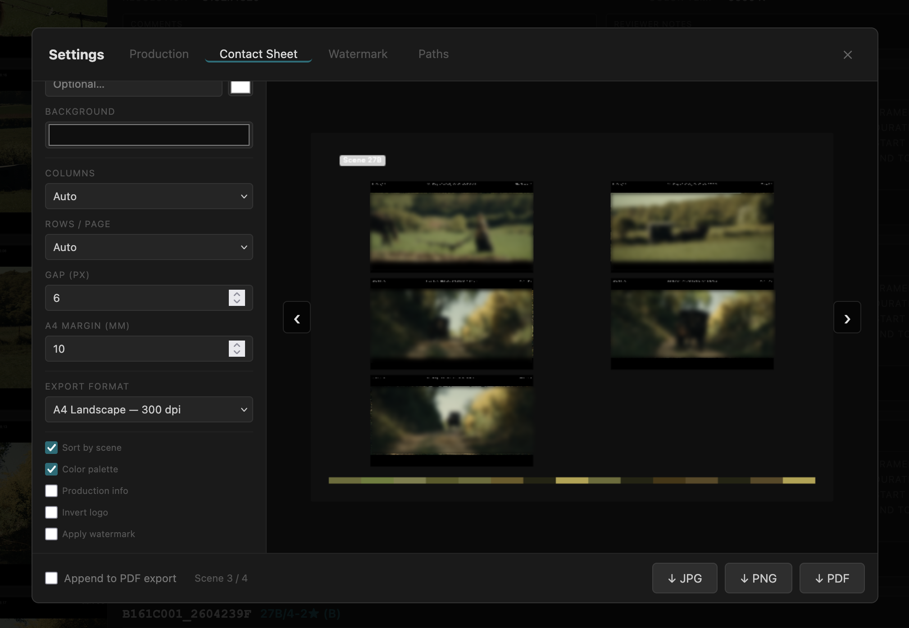
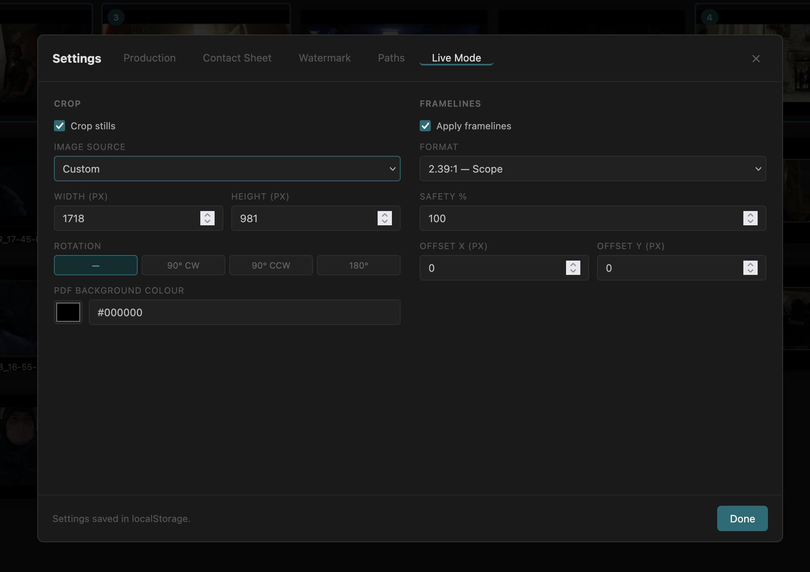

# Stills Manager

A local web app for browsing, curating and exporting image stills from a film shoot. Runs entirely on your machine — no cloud, no upload.

  

---
        

---

## Features

### Gallery & selections

- **Browse** any local folder containing JPG, PNG or TIF images
- **Include subfolders** — option in the folder browser to load images from all nested folders at once
- **Recent folders** — the last 8 opened folders are listed for quick access in the folder browser
- **Gallery** view with 16:9 thumbnails, up to 6 columns
- **Select all / Deselect all** — button next to the image count; adds or clears all images in the active selection in one click
- **Inverse selection** — button next to "Select all"; selects all images that are not in the current selection and deselects those that are
- **Fullscreen lightbox** — `Cmd`+`click` to view full size; vertical carousel with scroll/swipe navigation
- **Selections** — click a thumbnail to add/remove it; spacebar works in fullscreen
- **Multiple selections** via tabs — add, rename (double-click), reorder and delete
- **Drag & drop** reordering of images within a selection
- **Shuffle** — randomises the order of images in the active selection (button in the selection panel header)
- **Invert order** — reverses the order of images in the active selection (button in the selection panel header)
- **Reorder from fullscreen** — `Cmd`+`↑/↓` moves the current image up or down in the selection order
- **Undo / Redo** — full history for all selection edits (`Cmd`+`Z` / `Cmd`+`Shift`+`Z`)
- **Auto-save** — selections written as `.stills-selections.json` in the open folder, debounced at 350 ms
- **URL persistence** — the open folder is encoded in the URL; reloading the page reopens it automatically
- **Light / dark mode** — toggle with the ☀/☾ button; preference persisted in `localStorage`






### Clips Report view




        


Accessible via the top navigation. Requires a `._clips.json` or `._stills_metadata.json` file in the open folder.

> These metadata files are generated by [**DaVinci Resolve Stills & Markers**](https://github.com/brixybrice/DaVinci-Resolve-Stills-Markers), a companion DaVinci Resolve script that exports clip metadata, stills and markers from the current timeline. The Clips Report and all report exports depend on this data — but the gallery, selections and contact sheet work with any folder of images, no metadata required.

Accessible via the top navigation.

- One card per clip with thumbnail, full metadata (Camera, Optics, Color, Timing), Comments and Reviewer Notes
- Searchable by clip name or any metadata field
- Persists thumbnail choice per clip across sessions
- Half-page detail panel with all metadata fields

---

### Export

        


All exports are triggered from the **Export panel** (`Cmd+E`).

| Export | Format | Description |
|--------|--------|-------------|
| PDF Stills | PDF | One still per page, 16:9 landscape; optional watermark; optional contact sheet appended |
| Contact Sheet | JPG / PNG / PDF | Configurable grid; multi-page pagination; scene-grouped pages; production info header; colour palette band; optional watermark |
| Shoot Report | PDF A4 | Clips overview by camera, cards/reels table, scene breakdown with takes and good-take count |
| Clips Report | PDF A4 landscape | One row per clip with thumbnail, slate, metadata columns (Camera, Card, Optics, Color, Timing) and comments |
| QC Report | PDF A4 | Clip table with thumbnail, slate, comments and reviewer notes; production info header |
| ALE | Text | Avid Log Exchange — all clip metadata, tab-delimited |
| CSV | Text | All clip metadata as comma-separated values |

### Contact Sheet

  

The contact sheet has its own settings tab and live preview.

**Layout**
- Columns and rows per page — Auto or 1–8; when both are set, defines the grid exactly
- Gap between images (px)
- Export format: HD 1280 px, Full HD 1920 px, 4K 3840 px, A4 Portrait 300 dpi, A4 Landscape 300 dpi
- A4 margin (mm) — page margin applied on all four sides when exporting in A4 format

**Content options**
- **Title** — optional text drawn top-left on the first page, inside a pill-shaped badge; font colour picker; badge colour adapts automatically to the background (light badge on dark background, dark badge on light background)
- **Background colour** — canvas fill colour
- **Sort by scene** — re-orders stills using clip/marker metadata; when enabled, each scene gets its own page with a scene label badge
- **Production info** — draws a header block with project name, production company and crew; logo right-aligned; font colour adapts to background brightness; optional **Invert logo** to flip a dark logo on a dark background
- **Colour palette** — extracts three dominant colours per image and draws a colour band at the bottom of the canvas, one segment per image
- **Apply watermark** — tiles the watermark text over the canvas

**Preview navigation**
When the layout produces multiple pages (scene mode or rows-per-page pagination), `‹` / `›` arrows appear on the preview to browse pages before exporting.

**Append to PDF Stills export**
When *Append to PDF export* is checked, the contact sheet is appended to the PDF Stills export respecting all current Contact Sheet settings — including scene grouping, pagination, background colour, production info and colour palette.

### Settings (`Cmd`+`;`)

Five-tab panel (remembers the last open tab):

- **Production** — project name, production company, Director, DOP, DIT, ACs, Data Manager, logo (PNG); stored in `localStorage`; injected into all PDF report headers and the contact sheet production info block
- **Contact Sheet** — all layout and content options described above; live preview with page navigation
- **Watermark** — tiled text overlay with font, size, opacity and angle; live preview; applied to PDF Stills and optionally to the contact sheet
- **Paths** — configure the destination folder for each export type independently, or gang all exports to a single folder; optional "create sub-folder with title name"; folder browser included
- **Live Mode** — crop stills to a sensor area for exports and fullscreen preview (see below)

### Live Mode

  


Two-column panel — **Crop** on the left, **Framelines** on the right.

**Crop**
- **Crop stills** checkbox — enables the crop pipeline for thumbnails, lightbox and all exports
- **Image source** — camera preset or Custom:
  | Preset | Dimensions |
  |--------|-----------|
  | Arri Alexa 35 — 16:9 | 1739 × 980 px |
  | Arri Alexa 35 — Open Gate 3:2 | 1430 × 983 px |
  | Arri Alexa LF — 4.5K Magnum | 1711 × 998 px |
  | Red Raptor 8K VV — 17:9 | 1793 × 946 px |
  | Sony Venice 2 — 17:9 | 1728 × 913 px |
  | Custom | user-defined W × H |
- **Width / Height** — always visible; disabled when a preset is selected, editable in Custom mode
- **Rotation** — None, 90° CW, 90° CCW, 180°
- **PDF background colour** — canvas fill colour for PDF Stills exports

**Framelines**
- **Apply framelines** — crops further to a target aspect ratio within the sensor area
- **Format** — 16:9, 17:9, 2.39:1 (Scope), 1.85:1 (Flat), 2:1, 4:3, 3:2, 5:4, 1:1, or Custom ratio
- **Safety %** — scales the frameline crop down by the given percentage (50–100)
- **Offset X / Y** — shifts the frameline window within the sensor area (pixels)

Settings take effect when **Done** is clicked or on page load.

---

## Requirements

- Python 3.9+
- Flask 3.0+
- Pillow 10.0+ (TIF support — installed automatically via `pip install -r requirements.txt`)

---

## Installation

```bash
git clone <repo>
cd Stills-Manager
pip install -r requirements.txt
```

---

## Usage

```bash
python server.py
```

The app opens automatically at `http://localhost:5000`. Stop the server with **Ctrl+C**.

> Works best in **Firefox** or any modern browser. All file operations go through the local Flask server — no browser File System Access API required.

---

## Keyboard shortcuts

| Key | Action |
|-----|--------|
| `←` / `↑` | Previous image (fullscreen) |
| `→` / `↓` | Next image (fullscreen) |
| `Space` | Add / remove from selection (fullscreen) |
| `Cmd`+`↑` | Move image up in selection (fullscreen) |
| `Cmd`+`↓` | Move image down in selection (fullscreen) |
| `Esc` | Close fullscreen or modal |
| `Enter` | Open selected folder (folder browser) |
| `Cmd`+`Z` | Undo |
| `Cmd`+`Shift`+`Z` | Redo |
| `Cmd`+`O` | Open folder |
| `Cmd`+`;` | Open settings |
| `Cmd`+`E` | Open export panel |
| `Cmd`+`Shift`+`N` | New selection |
| `Cmd`+`click` | Open image fullscreen (gallery) |
| `Enter` | Trigger exports (export panel open) |
| `Enter` | Apply Live Mode settings (Live Mode tab open) |

---

## Data

Selections are saved as a JSON file (`.stills-selections.json`) in the open folder:

```json
{
  "selections": {
    "Folder name": ["img_001.jpg", "img_004.jpg"],
    "Selection 2": ["img_010.jpg"]
  },
  "selOrder": ["Folder name", "Selection 2"],
  "activeSel": "Folder name"
}
```

The file is created automatically when a folder is opened and updated on every change. It is hidden by default on macOS and Linux (dot-prefixed); use `ls -a` or **Show Hidden Files** in Finder (`Cmd`+`Shift`+`.`) to reveal it.

Production info, theme preference, export paths and contact sheet settings are stored in `localStorage` and persist across sessions.

---

## Project structure

```
Stills-Manager/
├── server.py        # Flask server — API, static serving, file-save endpoint
├── index.html       # Single-page app (HTML + CSS + JS)
└── requirements.txt
```

---

## License

MIT — free to use, modify and distribute. See [LICENSE](LICENSE) for details.

---

## Credits

Contact sheet layout concept and colour palette feature — [**Ben Chaude Woodman**](https://240p-is-fine.com/ContactSheetCreator.html)

Beta testing — **Simon Jayet**

Ideas & feedback — [**Olivier Patron**](https://github.com/Luronnade)
